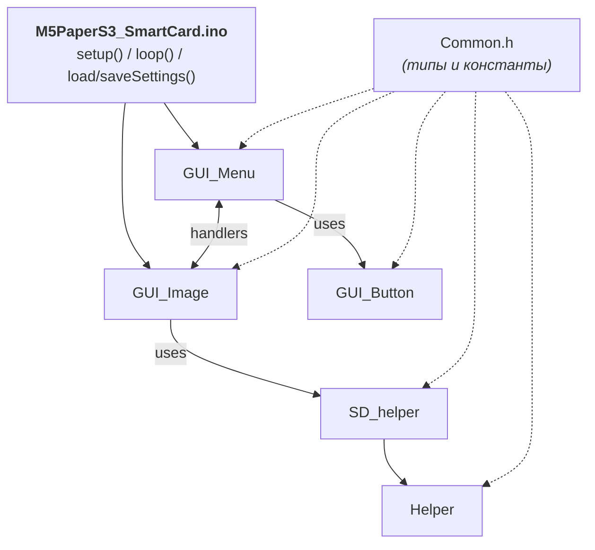
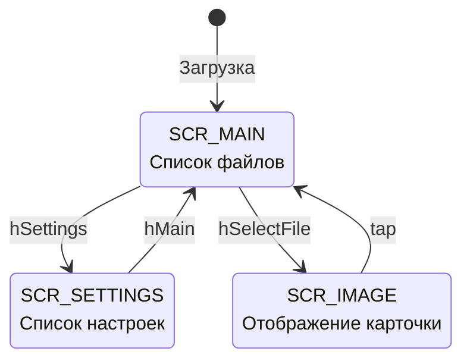

# M5PaperS3 SmartCard — техническая документация

Этот документ описывает **внутреннее устройство** проекта: модули, потоки данных, состояния, форматы хранения. Для пользовательского описания см. `README.md`.

---

## 1. Архитектура



---

## 2. Машина состояний



`Screen currentScreen` хранит текущее состояние:

| Значение       | Экран        | Содержимое                         |
| -------------- | ------------ | ---------------------------------- |
| `SCR_MAIN`     | Список PNG   | до 8 файлов + Prev/Next/Settings   |
| `SCR_SETTINGS` | Настройки    | повороты, debug, rescan, back      |
| `SCR_IMAGE`    | Полный экран | картинка + невидимая «back» кнопка |

---

## 3. Модули

### 3.1 `Common.h`

Единственный заголовок проекта. Содержит:

- pin-ы SD;
- лимиты (`MAX_PNG_FILES`, `MAX_BUTTONS`, `FILES_PER_PAGE`);
- параметры GUI (`BTN_HEIGHT`, `BTN_GAP`, `TOP_BAR_H`);
- структуру `Button` и тип `FuncHandler`;
- enum `Screen`;
- `extern`-объявления всех глобалов;
- прототипы всех функций.

> ⚠️ **Порядок include важен**: `<SD.h>` обязан стоять **до** `<M5Unified.h>`
и `<M5GFX.h>` — иначе шаблон `drawPngFile<fs::SDFS>` не специализируется.

### 3.2 `Globals.ino`

Определяет реальные переменные, объявленные `extern` в `Common.h`. Чтобы линкер
не ругался на дубликаты — переменные **только тут**.

### 3.3 `Helper.ino`

Утилиты строк:

| Функция                                | Назначение                             |
| -------------------------------------- | -------------------------------------- |
| `extractFileName(path, stripExt=true)` | Имя файла без пути и (опц.) расширения |
| `lower(s)`                             | Копия строки в нижнем регистре         |

### 3.4 `SD_helper.ino`

```text
startSdCard()
   ├── SPI.begin(SCK, MISO, MOSI, CS)
   ├── SD.begin(CS, SPI, FREQ)   ← до 3 попыток
   └── scanForPNGFiles()
         ├── collectPNG("/", depth=0)   ← рекурсивный обход
         └── sortFiles()                ← insertion sort, регистро-нез.
```

- Глубина рекурсии ограничена `MAX_SCAN_DEPTH = 5`.
- Имена сохраняются как полные пути от корня (`/folder/file.png`).
- Сортировка — простая вставка O(n²); для 100 файлов это ~10к сравнений,
мгновенно.

### 3.5 `GUI_Button.ino`

- `drawButton(b)` — рамка двойная + центрированный текст. При переполнении
текста — обрезка с `...`.
- `buttonHit(b, x, y)` — проверка попадания.

Высота кнопки фиксирована (`BTN_HEIGHT`), позиция считается в `layoutButtons()`.

### 3.6 `GUI_Menu.ino`

Главный модуль интерфейса.

#### Сборка экрана

1. `mainMenuInit()` / `settingsMenuInit()` — заполняют `menuButtons[]` через
`menuAddButton()`.
2. `layoutButtons()` — вычисляет координаты:
    - область: `[BTN_MARGIN_TOP .. H-10]`
    - если блок кнопок помещается — **центрируется по вертикали**;
    - иначе — прижимается к верху;
3. `drawMenu()` — `clear() + drawTopBar() + drawButton()×N`.

#### Обработка ввода — `guiUpdate()`

Вызывается каждые ~10 мс из `loop()`:

- `M5.Touch.getDetail()`
- `wasClicked()` → `handleTouch(x, y)` → перебор кнопок → handler.
- `wasFlicked()` (только в `SCR_MAIN`) → если |dx|>|dy| и |dx|>`FLICK_THRESHOLD`
→ `hPrev`/`hNext`.
- Раз в `BATTERY_UPDATE_MS` обновляется верхний бар (только не в `SCR_IMAGE`,
чтобы не мешать картинке).

#### Список handler'ов

| Handler           | Действие                              |
| ----------------- | ------------------------------------- |
| `hMain`           | Сброс страницы → главное меню         |
| `hSettings`       | Экран настроек                        |
| `hRescan`         | Пересканирование SD                   |
| `hNext` / `hPrev` | Пагинация                             |
| `hRotateMenu`     | Цикл 0→1→2→3→0 для меню, save, redraw |
| `hRotateImage`    | То же для изображений                 |
| `hToggleDebug`    | Toggle `showDebug`, save              |
| `hSelectFile`     | `showImage(button.data)`              |

### 3.7 `GUI_Image.ino`

```c
showImage(path):
  setEpdMode(quality)
  setRotation(imageRotation)
  clear(white)
  drawPngFile(SD, path, 0,0, W,H, 0,0, 0,0, middle_center)
        ↑
        автомасштаб с сохранением пропорций
  buttonCount = 1   (вся область — невидимая «назад» к hMain)
  if showDebug: рисуем имя файла
  setEpdMode(fast)  ← готовимся к меню
```

### 3.8 `M5PaperS3_SmartCard.ino`

- `setup()`: `M5.begin → loadSettings → startDisplay → startSdCard → speaker.volume → mainMenuInit`.
- `loop()`: `M5.update → guiUpdate → delay(10)`.
- `loadSettings/saveSettings` — через `Preferences` namespace `"smartcard"`:
  - `menuRot` (int)
  - `imgRot` (int)
  - `debug` (bool)

---

## 4. Глобальные данные

| Имя                 | Тип         | Описание                         |
| ------------------- | ----------- | -------------------------------- |
| `menuRotation`      | int         | поворот меню (0..3)              |
| `imageRotation`     | int         | поворот картинок (0..3)          |
| `showDebug`         | bool        | оверлей отладки                  |
| `currentScreen`     | Screen      | состояние UI                     |
| `currentMenuPage`   | int         | страница списка                  |
| `menuButtons[]`     | Button[12]  | активные кнопки                  |
| `buttonCount`       | int         | сколько занято                   |
| `pngFiles[]`        | String[100] | пути к PNG                       |
| `pngFileCount`      | int         | сколько найдено                  |
| `lastBatteryUpdate` | uint32_t    | millis() последнего апдейта бара |

---

## 5. GUI-метрики

```text
┌──────────────── TOP_BAR_H = 28 ────────────────┐
│ [C] 87% 4012mV  PNG:42  P:1                    │
├────────────────────────────────────────────────┤  ← разделитель
│                                                │
│  BTN_MARGIN_TOP = 36                           │
│   ┌──────────────────────────────────────┐ ▲   │
│   │            Button text               │ │   │
│   └──────────────────────────────────────┘ │   │
│                                            │ BTN_HEIGHT = 48
│   ┌──────────────────────────────────────┐ │   │
│   │            Button text               │ │   │
│   └──────────────────────────────────────┘ ▼   │
│                ↕ BTN_GAP = 8                   │
│   ...                                          │
│                                                │
│  BTN_MARGIN_X = 12  (слева и справа)           │
└────────────────────────────────────────────────┘
```

Если `total_height < area_height`, блок **центрируется**:
`startY = areaTop + (areaH - totalH) / 2`.

---

## 6. Жизненный цикл E-Ink режимов

| Действие          | Режим                | Почему                         |
| ----------------- | -------------------- | ------------------------------ |
| Перерисовка меню  | `epd_fast`           | 16 уровней, минимум мерцания   |
| Показ изображения | `epd_quality`        | максимум деталей               |
| После показа      | возврат в `epd_fast` | следующее меню — снова быстрое |

---

## 7. Сохранение в NVS

```cpp
Preferences p;
p.begin("smartcard", false);
p.putInt ("menuRot", ...);
p.putInt ("imgRot",  ...);
p.putBool("debug",   ...);
p.end();
```

NVS-namespace: **`smartcard`**. При первой загрузке отсутствующие ключи возвращают дефолты (`0`, `false`).

---

## 8. Расширение

### Добавить пункт в настройки

1. В `settingsMenuInit()` добавить `menuAddButton("My option", hMyHandler);`.
2. Реализовать `void hMyHandler(Button*) { … saveSettings(); settingsMenuInit(); }`.
3. Если нужна сохраняемая переменная — добавить в `Globals.ino`, `Common.h` (`extern`), `loadSettings/saveSettings`.

### Поддержка нового формата (например, JPG)

1. В `SD_helper.ino` в `collectPNG()` (можно переименовать) добавить условие на `.jpg`.
2. В `showImage()` выбрать `drawJpgFile` для соответствующего расширения.

### Сетка 2×N

- В `layoutButtons()` посчитать колонки: `cols = (W >= 700) ? 2 : 1`.
- `b.w = (W - (cols+1)*BTN_MARGIN_X) / cols`.
- Координаты: `col = i % cols; row = i / cols`.

### Скроллинг вместо пагинации

- Завести `int listOffset = 0`.
- На свайпы вверх/вниз менять offset на ±1.
- Перерисовывать только видимое окно (`offset .. offset+visibleCount`).

---

## 9. Известные ограничения

- Файлы > **MAX_PNG_FILES** игнорируются (увеличить лимит — поправить в `Common.h`).
- Имена в массиве `String` — расходуют heap. Для большого числа файлов лучше перейти на `char[256]`.
- Сортировка O(n²) — для 1000+ файлов будет заметна.
- Только PNG (RGB/RGBA), без анимации.
- Один источник ввода — touch. Кнопки устройства не задействованы.

---

## 10. Тестовый чек-лист

- [ ] Без SD: показывает «SD not detected».
- [ ] Пустая SD: 0 файлов, кнопка `Rescan`.
- [ ] 1 файл: одна кнопка, центрирована.
- [ ] 8 файлов: ровно одна страница, появляется `Rescan` вместо `Next`.
- [ ] 9+ файлов: появляется `Next >`, потом `< Prev`.
- [ ] Поворот меню сохраняется после reset.
- [ ] Поворот картинки сохраняется отдельно от меню.
- [ ] Тап по картинке → возврат в то же место списка.
- [ ] Свайп влево/вправо листает страницы.
- [ ] Длинное имя файла обрезается с `...`.
- [ ] Батарея обновляется не чаще, чем раз в минуту.

---

## 11. Версии

- **0.1.0** — начальная архитектура, переход на `.ino`-файлы + `Common.h`.
